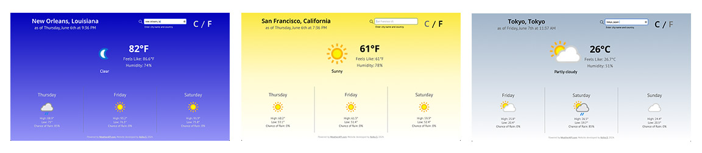

# odin-weather-app

## The Odin Project: Weather App

 
  

    
  

 

## Summary

This project is a weather forecast application developed using JavaScript, CSS, HTML, and managed through npm.

For more details on this project, please visit [The Odin Project - Project: Weather App](https://www.theodinproject.com/lessons/node-path-javascript-weather-app).

## Key Project Instructions

Develop the application with the following specifications:

**- Weather API:**  
Utilize the Weather API. The recommended provider as of May 2024 is [WeatherAPI](https://www.weatherapi.com/).

**- Search by Location:**  
Enable the app to be searchable by specific locations.

**- Temperature Converter:**  
Include a toggle to switch between Fahrenheit and Celsius.

**- Background Styling:**  
Style the background with a variety of colors or images based on the weather data retrieved from the API.

**- API Data Fetching:**  
Implement a function to fetch data from the API based on the user's requested location.

**- Raw Data Organization:**  
Transform the fetched data into JSON format. Then return it as an object containing only the data used in the app.

**- Location Search Box:**  
Add a form that captures location information and fetches data upon submission.

**- Optional Loader:**  
Optionally, include a loader to indicate when data fetching is in progress.

## Built With

- HTML
- CSS
- JavaScript
- Webpack
- ESLint
- Prettier
- date-fns

---

### Resources

- Weather Forecast API by [WeatherAPI](https://www.weatherapi.com)
- SVG Icons by [Pictogrammers](https://pictogrammers.com)
- google-webfonts-helper by [Mario Ranftl](https://gwfh.mranftl.com/fonts)
- Design Inspiration by [Dribbble](https://dribbble.com)
- Designing Tool by [Figma](https://www.figma.com)
- JavaScript Key Code Finder by [Toptal](https://www.toptal.com/developers/keycode)
- Search and Data Sorting by [ChatGPT-4 & MULTITASKER GPT-4 (Turbo)](https://chatgpt.com)
- Static HTTP Server for Production Version Testing by [http-server](https://github.com/http-party/http-server#readme)

### Referenced Tutorials

JavaScript Related:

- [onkeydown Event by W3Schools](https://www.w3schools.com/jsref/event_onkeydown.asp)
- [KeyboardEvent key Property by W3Schools]()
- [How TO - Trigger Button Click on Enter by W3Schools()](https://www.w3schools.com/howto/howto_js_trigger_button_enter.asp)
- [Date.prototype.getDay() by MDN Web Docs](https://developer.mozilla.org/en-US/docs/Web/JavaScript/Reference/Global_Objects/Date/getDay#description)
- [JavaScript forEach() – JS Array For Each Loop Example by freeCodeCamp](https://www.freecodecamp.org/news/javascript-foreach-js-array-for-each-example/)
- [How to add a loading animation while Fetch data from API? Vanilla js by StackOverflow](https://stackoverflow.com/questions/53799108/how-to-add-a-loading-animation-while-fetch-data-from-api-vanilla-js)
- [How to use Promise.prototype.finally \(\) in async/await syntax? by StackOverflow](https://stackoverflow.com/questions/50373337/how-to-use-promise-prototype-finally-in-async-await-syntax)
- [Finally in Promises & Try/Catch by Anna Rankin](https://dev.to/annarankin/finally-in-promises--trycatch-2c44)

CSS Related:

- [CSS Gradients W3Schools](https://www.w3schools.com/css/css3_gradients.asp)
- [Ordering flex items by MDN Web Docs](https://developer.mozilla.org/en-US/docs/Web/CSS/CSS_flexible_box_layout/Ordering_flex_items#the_order_property)
- [Background attachment: fixed; issues on mobile on Reddit](https://www.reddit.com/r/webdev/comments/119pabm/background_attachment_fixed_issues_on_mobile/)
- [RAM (Repeat, Auto, Minmax) by web.dev](https://web.dev/patterns/layout/repeat-auto-minmax)

HTML Related:

- [HTML \<input\> autofocus Attribute by W3Schools](https://www.w3schools.com/tags/att_input_autofocus.asp)

Git Related:
- [Deploying a subfolder to GitHub Pages by cobyism](https://gist.github.com/cobyism/4730490)